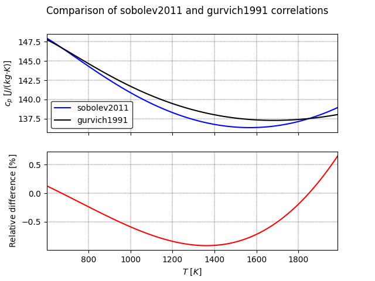

lbh15.lead module
==================
Module with liquid lead class.
Lead object can be initialized with the temperature
or with one of the available properties (see :class:`.Lead` for
the full list). It must be underlined that instantiation from properties
depends on the specific correlation of the properties implemented in
lbh15 package. In addition to the class attributes that are shown
in this section, :class:`.Lead` class dynamically adds the properties
implemented in :py:mod:`lbh15.properties.lead_properties` module. For instance:

>>> from lbh15 import Lead
>>> liquid_lead = Lead(T=668.15)
>>> liquid_lead.mu
0.0022534948395446985

Therefore the object comes with the following default properties:

    - :math:`T_{m0}` lead melting temperature:

        :math:`600.6 [K]`
    - :math:`Q_{m0}` lead melting latent heat:

        :math:`23.07\cdot10^3 \Big[\frac{J}{kg}\Big]`
    - :math:`T_{b0}` lead boiling temperature:

        :math:`2021 [K]`
    - :math:`Q_{b0}` lead vaporisation heat:

        :math:`858.6\cdot10^3 \Big[\frac{J}{kg}\Big]`
    - :math:`p_s` lead saturation vapour pressure :math:`[Pa]`:

        :math:`p_s(T) = \displaystyle5.79\cdot10^9\cdot\
        \exp{\Big(-22131/T\Big)}`
    - :math:`\sigma` lead surface tension
      :math:`\Big[\frac{N}{m}\Big]`:

        :math:`\sigma(T) = \displaystyle\Big(525.9
        - 0.113{\cdot}T\Big)\cdot10^{-3}`
    - :math:`\rho` lead density
      :math:`\Big[\frac{kg}{m^3}\Big]`:

        :math:`\rho(T) = \displaystyle11441 - 1.2795{\cdot}T`
    - :math:`\alpha` lead thermal expansion coefficient
      :math:`\Big[\frac{1}{K}\Big]`:

        :math:`\alpha(T) = \displaystyle\Big(8942 - T\Big)^{-1}`
    - :math:`u_s` speed of sound in lead
      :math:`\Big[\frac{m}{s}\Big]`:

        :math:`u_s(T) = \displaystyle1953 - 0.246{\cdot}T`
    - :math:`\beta_s` lead isentropic compressibility
      :math:`\Big[\frac{1}{Pa}\Big]`:

        :math:`\beta_s(T) = \displaystyle\frac{1}{\rho(T){\cdot}u_s(T)^2}`
    - :math:`c_p` lead specific heat capacity :math:`\Big[\
      \frac{J}{kg{\cdot}K}\Big]`, two correlations are available, 
      'sobolev2011' and 'gurvich1991'. The first one is the 
      default one used by :class:`.Lead`:

        :math:`c_p(T) = \displaystyle176.2 - 4.923\cdot10^{-2}{\cdot}T
        + 1.544\cdot10^{-5}{\cdot}T^2 - 1.524\cdot10^{6}{\cdot}T^{-2}`

        :math:`c_p(T) = \displaystyle175.1 - 4.961\cdot10^{-2}{\cdot}T
        + 1.985\cdot10^{-5}{\cdot}T^2 - 2.099\cdot10^{-9}{\cdot}T^3
        - 1.524\cdot10^{6}{\cdot}T^{-2}`
    - :math:`h` specific enthalpy (as difference with
      respect to the melting point enthalpy)
      :math:`\Big[\frac{J}{kg{\cdot}K}\Big]`:

        :math:`h(T) = \displaystyle
        176.2\cdot\Big(T - T_{m0}\Big) \
        - 2.4615\cdot10^{-2}\Big(T^2 - T_{m0}^2\Big)
        + 5.147\cdot10^{-6}\Big(T^3 - T_{m0}^3\Big)`

        :math:`\qquad\qquad+ 1.524\cdot10^6\Big(T^{-1} - T_{m0}^{-1}\Big)`
    - :math:`\mu` lead dynamic visocity :math:`[Pa{\cdot}s]`:

        :math:`\mu(T) = \displaystyle4.55\cdot10^{-4}\cdot\
        \exp{\Big(1069/T\Big)}`
    - :math:`r` lead electrical resistivity :math:`[\Omega{\cdot}m]`:

        :math:`r(T) = \displaystyle\Big(67.0 + 0.0471{\cdot}T\Big)
        \cdot10^{-8}`
    - :math:`k` lead thermal conductivity
      :math:`\Big[\frac{W}{m{\cdot}K}\Big]`:

        :math:`k(T) = \displaystyle9.2 + 0.011{\cdot}T`
    - :math:`Pr` Prandtl number :math:`[-]`:

        :math:`Pr = \displaystyle\frac{c_p\cdot\mu}{k}`

where :math:`T` is the lead temperature in :math:`[K]`.

The two :math:`c_p(T)` correlations are shown below,
together with their relative difference.

Finally, the object dynamically adds useful
methods to retrieve more information on specific thermophysical property
which are named :code:`<property_name>_info`. For instance:

>>> from lbh15 import Lead
>>> liquid_lead = Lead(T=668.15)
>>> liquid_lead.mu_info()
mu:
        Value: 0.0023 [Pa*s]
        Validity range: [600.60, 1473.00] K
        Long name: dynamic viscosity
        Units: [Pa*s]
        Description:
                Liquid lead dynamic viscosity

.. automodule:: lbh15.lead
    :members:
    :member-order: bysource
    :inherited-members:
   
