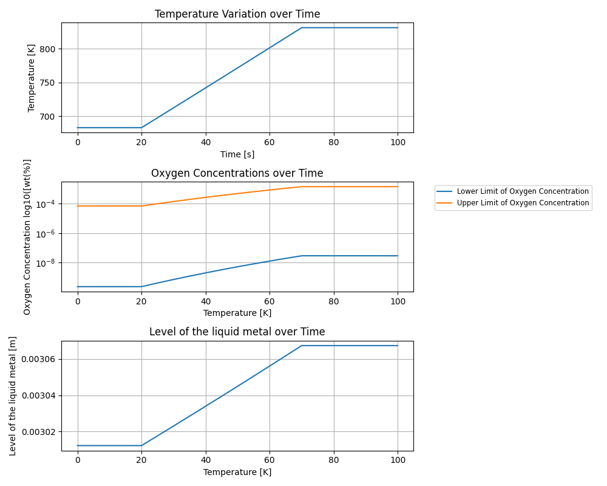

++++++++++++++
Oxygen control
++++++++++++++

Oxygen in lead and LBE systems, resulting from start-up operations,
maintenance phases and possibly incidental contaminations, is the most
important chemical compound for those systems :cite:`Agency2015`.
For the operating of a nuclear lead alloy system, the upper and lower oxygen 
limit concentrations need do be determined.

.. _ Oxygen concentration upper limit:

Oxygen concentration upper limit
================================

The upper limit corresponds to the oxygen concentration to avoid contamination by coolant oxides.
It is defined by the solubility of oxygen in lead alloys. The lbh15 provides
these relations in the ``lead_thermochemical_properties.solubility_in_lead``
and ``lbe_thermochemical_properties.solubility_in_lbe`` modules.
The correlations chosen to be implemented are extracted from the handbook's table 3.5.2,
"Oxygen solubility in liquid Pb, Bi and LBE", page 157, and were obtained by linear regression of
different correlations specified in the handbook.

.. _ Oxygen concentration lower limit:

Oxygen concentration lower limit
================================

The lower limit corresponds to the oxygen concentration to promote the formation of a protective oxide layer on the structural material.
It is theoretically possible when the oxygen potential in the liquid metal is above the
potential leading to the protective film formation. The correlations given in
``lead_thermochemical_properties.lead_oxygen_limits`` and ``lbe_thermochemical_properties.lbe_oxygen_limits``
are implemented following the methodology given in the handbook's chapter 4, part 4.2.2,
pages 187-191. You can find more details about it in the following lines.

After determining the reaction equation and the Gibbs free energy associated, we will express the oxygen
concentration as a function of temperature and finally present the correlations implemented.

..

First we have to define the equation of the oxidation reaction  (3) and the Gibbs free energy associated.
  According to the handbook, this reaction occurs between the metal and the oxygen, with the oxygen
  supposed in solution in the form of dissolved PbO, below its saturation limit. 
  
  In order to obtain this reaction equation, we have to combine the formation equation of the metal oxide (1)
  given in the handbook in the chapter 4, part 4.2.2, equation 4.5, page 188, and the formation equation of PbO (2), given
  in the handbook table 4.2.2, p.189.

    (1)
    :math:`\frac{2X}{Y}Me_{(dissolved)} + O_{2(dissolved)} \longrightarrow \frac{2}{Y}Me_XO_Y`, associated to :math:`\Delta G^0_{(1)}`

    (2)
    :math:`2Pb + O_2 \longrightarrow 2PbO`, associated to :math:`\Delta G^0_{(2)}`

  We can then obtain the oxidation reaction equation for a mole of PbO:

    (3)
    :math:`\frac{X}{Y}Me_{(dissolved)} + O_{(dissolved)} + PbO \longrightarrow \frac{1}{Y}Me_XO_Y + Pb + O`,
    associated to
    
    :math:`\Delta G^0_{(3)} = \frac{\Delta G^0_{(1)}-\Delta G^0_{(2)}}{2}`
    :math:`= \frac{\left(\Delta H^0_{(1)}-T\cdot\Delta S^0_{(1)}\right)-\left(\Delta H^0_{(2)}-T\cdot\Delta S^0_{(2)}\right)}{2}`
    :math:`= \frac{\Delta H^0_{(3)}-T\cdot\Delta S^0_{(3)}}{2}`, with
    
    :math:`\Delta H^0_{(3)} = \Delta H^0_{(1)}-\Delta H^0_{(2)}`
    and :math:`\Delta S^0_{(3)} =\Delta S^0_{(1)}-\Delta S^0_{(2)}`
  
  :math:`Me` represents the metal of the structural material involved in the oxidation reaction,
  :math:`X` and :math:`Y` are coefficients specific to the reaction.

  The :math:`\Delta H^0` and :math:`\Delta S^0` values for each reaction are taken from the Table 4.2.2 of the handbook.

..

We will now develop how to obtain a correlation depending on the oxygen concentration.
  To obtain a relation that has the same form as the relation in the handbook, chapter 4, part 4.2.2, equation 4.12,
  we use the relation :math:`\Delta_rG^0_{(T)} = -RT \ln{(K_{(T)})}`, with:
  
  - :math:`T` the temperature in :math:`[K]`

  ..

  - :math:`R` the molar gas constant in :math:`[J\cdot K^{-1} \cdot mol^{-1}]`

  ..

  - :math:`\Delta_rG^0_{(T)}` the standard free enthalpy at constant pressure and temperature in :math:`[J\cdot mol^{-1}]`
  
  ..

  - :math:`K_{(T)}` the equilibrium constant defined by the relation :math:`\prod\limits_{i=1}^{N} \alpha_{i(f)}^{\nu_i}`,
    with :math:`\alpha_{i(f)}` the chemical activity of the specie :math:`i` at the equilibrium,
    :math:`\nu_i` the stoichiometric coefficient of the :math:`i` specie, :math:`\nu_i` positive for the
    reaction products and negative for the reactants, and :math:`N` the number of components
  
  ..
  
  - The chemical activity :math:`\alpha` is a dimensionless quantity used to express the deviation
    of a mixture of chemical substances from a standard behaviour.
    It can be defined by the following relations:

    - :math:`\alpha_i = \gamma_i\cdot\chi_i` , with :math:`\gamma` the dimensionless activity coefficient
      of the :math:`i` specie and :math:`\chi_i` the molar fraction of this specie

    - :math:`\alpha_i = \gamma_i\cdot\frac{C_i}{C_{iref}}` with :math:`C_i` the concentration of the
      specie in the mixture and :math:`C_{iref}` a chosen standard concentration for the specie

    In the handbook, it is specified that the concentration chosen as the standard concentration
    is the concentration at saturation. Also, by definition, the activity coefficient of a pure
    element is equal to one, and the coefficient activity of an element in a very diluted solution 
    can also be considered as equal to one. Those considerations have been made in the handbook,
    and the activity of pure a pure element can then be defined as : :math:`\alpha_i=\frac{C_i}{C_{i(sat)}}`.
    Concerning the lead chemical activity in LBE, we use the one recommended in the handbook,
    chapter 3, part 3.3, proposed by Gossé (2014).
  
  According to the oxidation reaction equation (3) previously shown, we can write:
  :math:`\Delta_rG^0_{(T)}=-RT\ln{\left(\frac{\alpha_{Pb(f)}\cdot\alpha_{Me_XO_Y(f)}^{\frac{1}{Y}}}{\alpha_{PbO(f)}\cdot\alpha_{Me{(dissolved)}}^{\frac{X}{Y}}}\right)}`

  :math:`\Leftrightarrow \quad \frac{\Delta_rG^0_{(T)}}{RT} = \ln{\left(\alpha_{Pb0(f)}\cdot\alpha_{Me{(dissolved)}}^{\frac{X}{Y}}\right)} -\ln{\left(\alpha_{Pb(f)}\right)}`

  :math:`\Leftrightarrow \quad \ln{\left(\alpha_{PbO(f)}\cdot\alpha_{Me{(dissolved)}}^{\frac{X}{Y}}\right)} = \frac{\Delta_rG^0_{(T)}}{RT} + \ln{\left(\alpha_{Pb(f)}\right)}`

  :math:`\Leftrightarrow \quad \ln{\left(\alpha_{PbO(f)}\right)} = - \frac{X}{Y}\ln{\left(\alpha_{Me{(dissolved)}}\right)} + \frac{1}{RT}\cdot\frac{\Delta H^0_{(3)}-T\cdot\Delta S^0_{(3)}}{2} + \ln{\left(\alpha_{Pb(f)}\right)}`

  :math:`\Leftrightarrow \quad \ln{\left(\alpha_{PbO(f)}\right)} = - \frac{X}{Y}\ln{\left(\alpha_{Me{(dissolved)}}\right)} + \frac{\Delta H^0_{(3)}}{2RT} - \frac{\Delta S^0_{(3)}}{2R} + \ln{\left(\alpha_{Pb(f)}\right)}`

  :math:`\Leftrightarrow \quad \ln{\left(\frac{C_O}{C_O^{sat}}\right)} = - \frac{X}{Y}\ln{\left(\frac{C_{Me}}{C_{Me}^{sat}}\right)} + \frac{\Delta H^0_{(3)}}{2RT} - \frac{\Delta S^0_{(3)}}{2R} + \ln{\left(\alpha_{Pb(f)}\right)}`

  :math:`\Leftrightarrow \quad \ln{\left( C_O \right)} = - \frac{X}{Y}\ln{\left(C_{Me}\right)} + \frac{X}{Y}\ln{\left(C_{Me}^{sat}\right)} + \frac{\Delta H^0_{(3)}}{2RT} - \frac{\Delta S^0_{(3)}}{2R} + \ln{\left(\alpha_{Pb(f)}\right)} + \ln{\left(C_O^{sat}\right)}`
  
  As mentionned before, the oxygen is supposed in solution in the form of dissolved PbO below its
  saturation limit. According to the handbook, dissolved oxygen chemical activity can then
  refers to dissolved PbO chemical activity.

..

Using the previous equation, we provided two different correlations, depending on the considerations about the metal activity.
  - The actual activities at the interface are influenced by how diffusion, convection and
    mass tranfer occurs in the oxide layer and in the liquid metal boundary layer.
    As a result, we don't know the exact metal and oxygen chemical activities. Ongoing researches
    are in progress, but as first approximations, we will consider the metal activity equal to one
    as in the handbook. Simplifications can then be made as following:

    :math:`\ln{\left( C_O \right)} = - \frac{X}{Y}\ln{\left(\frac{C_{Me}}{C_{Me}^{sat}}\right)} + \frac{\Delta H^0_{(3)}}{2RT} - \frac{\Delta S^0_{(3)}}{2R} + \ln{\left(\alpha_{Pb(f)}\right)} + \ln{\left(C_O^{sat}\right)}`

    :math:`\Leftrightarrow \quad \ln{\left( C_O \right)} = - \frac{X}{Y}\ln{\left(1\right)} + \frac{\Delta H^0_{(3)}}{2RT} - \frac{\Delta S^0_{(3)}}{2R} + \ln{\left(\alpha_{Pb(f)}\right)} + \ln{\left(C_O^{sat}\right)}`

    :math:`\Leftrightarrow \quad \ln{\left( C_O \right)} = \frac{\Delta H^0_{(3)}}{2RT} - \frac{\Delta S^0_{(3)}}{2R} + \ln{\left(\alpha_{Pb(f)}\right)} + \ln{\left(C_O^{sat}\right)}`

    :math:`\Leftrightarrow \quad C_O = \exp{\left(\frac{\Delta H^0_{(3)}}{2RT} - \frac{\Delta S^0_{(3)}}{2R} + \ln{\left(\alpha_{Pb(f)}\right)} + \ln{\left(C_O^{sat}\right)}\right)}`
        
    We can now compute the lower concentration limit for oxygen using oxygen solubility data. We chose
    to implement the ones recommended in the handbook chapter 3, part 3.5.2, Table 3.5.2, page 157.

    If the considered system is pure lead, the lead activity is equal to one as previously explained.
    If the considered system is LBE, the lead activity used in the package is the one recommended in the handbook,
    chapter 3, part 3.3, proposed by Gossé (2014).
  
  ..
  
  - If we don't consider the metal activity equal to one, the previous simplification can't be made
    and the correlation then have two entry points: the temperature and the metal concentration. Since
    we want our package to only have one entry point, we have to modify the previous relation like following:

    :math:`\Leftrightarrow \quad \ln{\left( C_O \right)} = - \frac{X}{Y}\ln{\left(C_{Me}\right)} + \frac{X}{Y}\ln{\left(C_{Me}^{sat}\right)} + \frac{\Delta H^0_{(3)}}{2RT} - \frac{\Delta S^0_{(3)}}{2R} + \ln{\left(\alpha_{Pb(f)}\right)} + \ln{\left(C_O^{sat}\right)}`

    :math:`\Leftrightarrow \quad \ln{\left( C_O \right)} + \frac{X}{Y}\ln{\left(C_{Me}\right)} = \frac{X}{Y}\ln{\left(C_{Me}^{sat}\right)} + \frac{\Delta H^0_{(3)}}{2RT} - \frac{\Delta S^0_{(3)}}{2R} + \ln{\left(\alpha_{Pb(f)}\right)} + \ln{\left(C_O^{sat}\right)}`

    :math:`\Leftrightarrow \quad \ln{\left( C_O  \cdot C_{Me}^{\frac{X}{Y}}\right)} = \frac{X}{Y}\ln{\left(C_{Me}^{sat}\right)} + \frac{\Delta H^0_{(3)}}{2RT} - \frac{\Delta S^0_{(3)}}{2R} + \ln{\left(\alpha_{Pb(f)}\right)} + \ln{\left(C_O^{sat}\right)}`

    :math:`\Leftrightarrow \quad C_O  \cdot C_{Me}^{\frac{X}{Y}} = \exp{\left(\frac{X}{Y}\ln{\left(C_{Me}^{sat}\right)} + \frac{\Delta H^0_{(3)}}{2RT} - \frac{\Delta S^0_{(3)}}{2R} + \ln{\left(\alpha_{Pb(f)}\right)} + \ln{\left(C_O^{sat}\right)}\right)}`
    
    We can now compute the lower concentration lim for oxygen times the metal concentration raised to a certain exponent, using the metal solubility.
    

.. _ Ranges of validity:

Ranges of validity
==================

As previously shown, multiple correlations need to be use in order to compute the oxygen concentration
lower limits, each having a particular temperature range of validity. The temperature range of
validity specified in the lbh15 package for each lower limit correlations is the most restrictive one.

Here are the different range of validity choices:
  - For the lower limit oxygen concentration when the metal is at its saturation, we use the lower temperature
    limit of the oxygen solubility and the upper limit of main oxides free enthalpy coefficients, which gives
    us a [673;1000] K range.
  
  ..

  - For the lower limit oxygen concentration times the metal concentration raised to a certain exponent,
    for most of the correlations, we use the lower temperature limit of the oxygen solubility and the upper
    limit of main oxides free enthalpy coefficients, which gives us a [673;1000] K range for most of the correlations.
    Here are some particular ranges of validity:

    - For the correlation using the relation of the chromium solubility in LBE given by Courouau in 2004, we
      use the upper limit of the chromium solubility correlation which gives us a [673;813] K range

    ..

    - For the correlation using the relation of the chromium solubility in LBE given by Martynov in 1998, we
      use the upper limit of the chromium solubility correlation which gives us a [673;773] K range
    
    ..
    
    - For the correlation using the relation of the nickel solubility in lead given by Gossé in 2014, we
      use the upper limit of the nickel solubility correlation which gives us a [673;917] K range.

    ..
    
    - For the correlation using the relations of the chromium solubility in lead given by Venkatraman in 1988 and
      by Alden in 1958, and the correlation using the relation of the silicon solubility in lead extracted from Tecdoc,
      released in 2002, there is no intersection between the temperature validity ranges. We chose to implement it
      with a [673;1000] K range. These relations thus needed to be used carefully.

.. _ Default correlations choices:

Default correlations choices
============================

For most of the relations, correlations from different authors were given. This part precises
which correlations have been chosen as the default ones and why. If a relation is not mentioned, it either means that 
there was only one correlation or that one correlation was specifficaly recommended in the handbook.

- Solubility: for iron, nickel and chromium solubility in lead, LBE and bismuth, correlations given by Gossé in 2014 were chosen

..

- Oxygen partial pressure divided by the oxygen concentration squared in lead: the correlation given by Alcock in 1964 was chosen

..

- Oxygen partial pressure divided by the oxygen concentration squared in bismuth: the correlation given by Isecke in 1979 was chosen

..

- Oxygen diffusivity in lead: the correlation given by Gromov in 1996 was chosen

..

- Oxygen diffusity in lbe: the correlation given by Gromov in 1996 was chosen

..

- Oxygen diffusivity in bismuth: the correlation given by Fitzner in 1964 was chosen

..

These choices were made considering the handbook's recommendations and the temperature ranges. We chose the correlations
given for temperature ranges as low as possible since most of the liquid lead applications are working at lower temperatures. 
We also took into account the size of the validity ranges, taking the larger ones when it was consistent with the previous
criterion. We invite the user to check the ranges of validity of the correlations he is using to make sure it correponds to
his application. If the user wants to work with other correlations, it is possible as explained in the "Advanced usage" section.

+++++++++
Tutorials
+++++++++

This section contains an example of the application of the complete package.
We chose to performed this tutorial considering a liquid lead system, in a cylindrical iron thank.

This tutorial is aimed to compute:
  - the temperature variation over time

  - the level of the liquid metal over temperature

  - the oxygen concentration limits over temperature

  - the mean limit oxygen concentration over temperature

The user can define:
  - the mass of the system

  - the initial temperature

  - the simulation duration

  - the power variation

  - the starting and ending time of this varition

  - the radius of the tank

- The first step is to import all the modules needed and to set the constants:

  .. code-block:: python

    """Tutorial using thermophysical and thermochemical
    correlations of the lbh15 python package"""
    import numpy as np
    import matplotlib.pyplot as plt
    from lbh15 import Lead

    if __name__ == "__main__":

        # Setting of the constants
        T_0 = 683  # [K]
        SIMULATION_TIME = 100  # [s]
        STEP_SIZE = 0.1  # [s]
        MASS = 100  # [kg]
        #  Power variation
        NET_POWER = 43000  # [W]
        VARIATION_START = 20  # [s]
        VARIATION_END = 70  # [s]
        RADIUS = 1  # [m]

- We then have to create all the arrays that will contain the values we are interested in:

  .. code-block:: python

    # Creation of the arrays
    # Array containing the time values
    time = np.arange(0, SIMULATION_TIME, STEP_SIZE)
    # Array containing the heat variation values
    heat_variation = np.zeros(len(time)-1)
    # Array containing the temperature values
    temperature = np.zeros_like(time)
    # Array containing the lower oxygen concentration values
    lower_oxygen_concentration = np.zeros_like(time)
    # Array containing the upper oxygen concentration values
    upper_oxygen_concentration = np.zeros_like(time)
    # Array containing the level of the liquid metal in the tank
    level = np.zeros_like(time)

- Before starting the loop which wil computes our results, we have to initialize the temperature
  and the power variation, such that at each time step of the total variation time,
  the power will have the same variation value. 

  .. code-block:: python

        # Filling of the heat variation array,
        # computed according to the power variation
        VAR_START_IDX = int(VARIATION_START/STEP_SIZE)
        VAR_END_IDX = int(VARIATION_END/STEP_SIZE)
        heat_variation[VAR_START_IDX:VAR_END_IDX] = (
            NET_POWER * STEP_SIZE)

        # Initialization
        temperature[0] = T_0
        system = Lead(T=T_0)
        h_0 = system.h
        upper_oxygen_concentration[0] = system.o_sol
        lower_oxygen_concentration[0] = system.lim_fe_sat
        volume = MASS / system.rho
        level[0] = volume / (np.pi * (RADIUS**2))

        # Looping
        for i in range(1, len(time)):
            # Solving heat balance
            h_i = np.sum(heat_variation[0:i])/MASS + h_0
            # Creation of an object at a T temperature deduced from the h value
            system = Lead(h=h_i)
            temperature[i] = system.T
            # Updating the lower oxygen concentration
            lower_oxygen_concentration[i] = system.lim_fe_sat
            # Updating the upper oxygen concentration
            upper_oxygen_concentration[i] = system.o_sol
            # Updating the volume of the system
            volume = MASS / system.rho
            # Updating the level of the liquid metal
            level[i] = volume / (np.pi * (RADIUS**2))

- Finally, we have to plot the graphs we are interested in. Here an example of what can be obtained:
 

.. note:: This example can be used with Bismuth or LBE and considering an other metal than iron for the thank.
