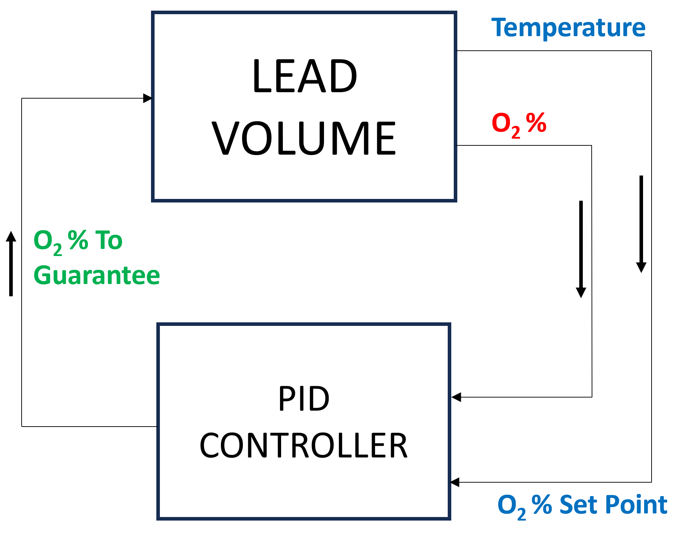

.. _oxygen control:

++++++++++++++
Oxygen Control
++++++++++++++

In lead and LBE systems, Oxgyen is the most important chemical element, which results
from start-up operations, maintenance services and possibily incidental contaminations (:cite:`Agency2015`).
For the operation of a nuclear reactor cooled by a lead alloy, it is thus important to
determine the upper and the lower oxygen concentration limits.

.. _ Oxygen concentration upper limit:

Oxygen Concentration Upper Limit
================================

The upper limit corresponds to the oxygen concentration value above which contamination by coolant oxides occurs.
It is represented by the *oxygen solubility* in lead and LBE alloys. *lbh15* provides
these properties in the ``lead_thermochemical_properties.solubility_in_lead``
and ``lbe_thermochemical_properties.solubility_in_lbe`` modules.
The implemented data are extracted from :cite:`Agency2015`, table 3.5.2,
"*Oxygen solubility in liquid Pb, Bi and LBE*", page 157: they were obtained by linear regression of
several correlations specified therein.

.. _ Oxygen concentration lower limit:

Oxygen Concentration Lower Limit
================================

The lower limit corresponds to the minimum value of the oxygen concentration enabling the formation of a protective oxide layer on the structural material.
The oxide layer formation is possible only when the oxygen potential in the liquid metal is above the
potential leading to the protective film formation. The correlations implemented in the
``lead_thermochemical_properties.lead_oxygen_limits`` and ``lbe_thermochemical_properties.lbe_oxygen_limits``
modules for computing the lower limits of oxygen concentration are obtained by applying the methodology
described in :cite:`Agency2015`, chapter 4, part 4.2.2, pages 187-192. A brief summary is provided in the following.

First of all, the reference reaction equation and the associated Gibbs free energy are determined. Then, the oxygen
concentration is expressed as a function of temperature. Eventually, two kinds of correlations, based on two different
assumptions, are derived.

..

  1. The equation of the oxidation reaction (3) is set by considering that it occurs
     between the metal and the oxygen, with the oxygen supposed in solution as dissolved *PbO* below its saturation limit.
     The formation equation of the metal oxide (1) (equation 4.5, page 188 of :cite:`Agency2015`) is combined with the formation
     equation of *PbO* (2), (table 4.2.2, page 189 of :cite:`Agency2015`):

     :math:`\frac{2X}{Y}Me_{(dissolved)} + O_{2(dissolved)} \longrightarrow \frac{2}{Y}Me_XO_Y \quad` (1)

     :math:`2Pb + O_2 \longrightarrow 2PbO \quad` (2)

     thus resulting in the following oxidation reaction equation for a mole of *PbO*:

     :math:`\frac{X}{Y}Me_{(dissolved)} + O_{(dissolved)} + PbO \longrightarrow \frac{1}{Y}Me_XO_Y + Pb + O`, :math:`\quad` (3)

     where:

     - :math:`Me` represents the metal of the structural material involved in the oxidation reaction,
     - :math:`X` and :math:`Y` are coefficients specific to the reaction.

..

  2. The Gibbs free energy associated to equation (3) is:

     :math:`\Delta G^0_{(3)} = \frac{\Delta G^0_{(1)}-\Delta G^0_{(2)}}{2}`
     :math:`= \frac{\left(\Delta H^0_{(1)}-T\cdot\Delta S^0_{(1)}\right)-\left(\Delta H^0_{(2)}-T\cdot\Delta S^0_{(2)}\right)}{2}`
     :math:`= \frac{\Delta H^0_{(3)}-T\cdot\Delta S^0_{(3)}}{2}`, where:

     - :math:`\Delta G^0_{(i)}` is the Gibbs free energy of formation related to the (i)-th reaction equation;
     - :math:`\Delta H^0_{(3)} = \Delta H^0_{(1)}-\Delta H^0_{(2)}` is the formation enthalpy related to equation (3);
     - :math:`\Delta S^0_{(3)} =\Delta S^0_{(1)}-\Delta S^0_{(2)}` is the formation entropy related to equation (3);
     - :math:`\Delta H^0` and :math:`\Delta S^0` values for each reaction are taken from the table 4.2.2 of :cite:`Agency2015`.

..

  3. In general, the Gibbs free energy of a reaction can also be expressed in the following way:

     :math:`\Delta_rG^0_{(T)} = -RT \ln{(K_{(T)})}`, where:

     - :math:`T` is the temperature in :math:`[K]`;

     - :math:`R` is the molar gas constant in :math:`[J\cdot K^{-1} \cdot mol^{-1}]`;

     - :math:`\Delta_rG^0_{(T)}` is the standard free enthalpy of reaction at constant pressure
       and temperature in :math:`[J\cdot mol^{-1}]`;

     - :math:`K_{(T)} = \prod\limits_{i=1}^{N} \alpha_i^{\nu_i}` is the equilibrium constant,
       being :math:`\alpha_i` the chemical activity of the :math:`i`-th species at the equilibrium,
       :math:`\nu_i` the stoichiometric coefficient of the :math:`i`-th species in the related reaction
       (positive for the reaction products and negative for the reactants), and :math:`N` the number of
       components appearing in the related reaction.

     In detail, the chemical activity :math:`\alpha` is a dimensionless quantity used to express the deviation
     of a mixture of chemical substances from a standard behaviour. It is defined by the following relations:

     - :math:`\alpha_i = \gamma_i\cdot\chi_i` , being :math:`\gamma` the dimensionless activity coefficient
       of the :math:`i`-th species and :math:`\chi_i` the molar fraction of the same species;

     - :math:`\alpha_i = \gamma_i\cdot\frac{C_i}{C_{iref}}`, being :math:`C_i` the concentration of the
       :math:`i`-th species in the mixture and :math:`C_{iref}` the reference concentration for the same species.

     In :cite:`Agency2015`, the concentration at saturation is adopted as reference concentration. In addition,
     by definition, the activity coefficient is assumed equal to one in two cases: when the related species is a pure chemical
     element, and when it is very diluted. The activity of a pure element can then be defined as:
     
     :math:`\alpha_i=C_i / C_i^{sat}`.

     About the chemical activity of lead in LBE, *lbh15* implements the correlation proposed by Gossé (2014)
     and written in chapter 3.3, part 3.3 of :cite:`Agency2015`.

..

  4. The aim is now to develop, for each possible dissolved metal, a correlation for the lower limit of the
     oxygen concentration that has the same structure as the equation 4.12, part 4.2.2 of :cite:`Agency2015`. Starting from the
     oxidation reaction equation (3), the following substitution is applied:

     :math:`\Delta_rG^0_{(T)}=-RT\ln{\left(\frac{\alpha_{Pb}\cdot\alpha_{Me_XO_Y}^{\frac{1}{Y}}}{\alpha_{PbO}\cdot\alpha_{Me{(dissolved)}}^{\frac{X}{Y}}}\right)}`,

     where the term :math:`\alpha_{Me_XO_Y}` can be considered equal to one: the lower limit is to be found of the oxygen
     concentration, thus the metal oxyde is considered very diluted.

     By considering the oxygen dissolved in the solution in the form of *PbO* below its saturation limit, as stated in :cite:`Agency2015`,
     thus taking the chemical activity of the dissolved oxygen equal to the chemical activity of the dissolved *PbO*, and by
     applying some transformations, one can obtain:

     :math:`\ln{\left( C_O \right)} = - \frac{X}{Y}\ln{\left(C_{Me}\right)} + \frac{X}{Y}\ln{\left(C_{Me}^{sat}\right)} + \frac{\Delta H^0_{(3)}}{2RT} - \frac{\Delta S^0_{(3)}}{2R} + \ln{\left(\alpha_{Pb}\right)} + \ln{\left(C_O^{sat}\right)} \quad` (4)

     In the above equation, the unknows are two, that is, the oxygen concentration :math:`C_O` and the concentration
     :math:`C_{Me}` of the dissolved metal, thus preventing the direct computation of the solution. For achieving
     a useful correlation, the user can choose between two strategies that are proposed and adopted in *lbh15*. They differ
     on how they treat the chemical activity of the dissolved metal. The actual activities at the interface are
     influenced by how diffusion, convection and mass transfer phenomena interact in the liquid metal boundary layer.
     Ongoing researches are in progress, but currently the exact values for the chemical activities of the dissolved
     metal and of the oxygen are not known.

     a. The first approach is to consider the chemical activity of the dissolved metal equal to one.
        In this way, the first and the second terms of the right hand side of equation (4) become zero, enabling to
        compute the lower limit of the oxygen concentration directly through the following relation:

        :math:`C_O = \displaystyle \alpha_{Pb} \cdot C_O^{sat} \cdot \exp{\left(\frac{\Delta H^0_{(3)}}{2RT} - \frac{\Delta S^0_{(3)}}{2R} \right)}`,

        where:
  
        - :math:`\Delta H^0_{(3)}` and :math:`\Delta S^0_{(3)}` are extracted from table 4.2.2 of :cite:`Agency2015`;

        - :math:`C_O^{sat}` is computed by adopting the recommended coefficients from table 3.5.2 of :cite:`Agency2015`;

        - :math:`\alpha_{Pb}` is taken equal to one in pure Lead, while in LBE it is computed by adopting the
          correlation proposed by Gossé as indicated at page 146 of :cite:`Agency2015`.

     b. The second approach does not exploit any assumption. In order to make equation (4) solvable, the two unknowns
        :math:`C_O^{sat}` and :math:`C_{Me}` are collected into one single unknown, thus expressing equation (4) in terms
        of :math:`C_O  \cdot C_{Me}^{\frac{X}{Y}}`, as indicated in the following:

        :math:`C_O \cdot C_{Me}^{\frac{X}{Y}} = \displaystyle \alpha_{Pb} \cdot C_O^{sat} \cdot \left(C_{Me}^{sat}\right)^{X/Y} \cdot \exp{\left(\frac{\Delta H^0_{(3)}}{2RT} - \frac{\Delta S^0_{(3)}}{2R}\right)}`,

        where:

        - :math:`C_{Me}^{sat}` values are computed by using the data from table 3.5.1 of :cite:`Agency2015`;

        - :math:`\Delta H^0_{(3)}`, :math:`\Delta S^0_{(3)}`, :math:`C_O^{sat}` and :math:`\alpha_{Pb}` are computed as already
          indicated for the approach described above.

.. _ Ranges of validity:

Ranges of Validity
==================

As stated in the previous section, multiple correlations are involved in the computation of the lower limits of
oxygen concentration, each being valid over a specific temperature range. The temperature range of
validity specified in the *lbh15* package for each correlation is the most restrictive one.

In the following, the choices are detailed about the validity ranges that have been adopted:

  - For the lower limit correlations based on the saturation assumption (approach *a*), the lower temperature
    value is taken equal to the lower limit of the validity range of the oxygen solubility correlation,
    while the upper temperature value is taken equal to the upper limit of the validity range of the main
    oxides free enthalpy coefficients. The result is the [673;1000] *K* range.
  
  ..

  - For the lower limit of the oxygen concentration times the metal concentration raised to a certain exponent (approach *b*),
    the validity range is taken equal to that in the approach *a*, that is, [673;1000] *K*, but for the following correlations:

    - Concerning the chromium solubility in LBE given by Courouau in 2004, the upper limit of the validity range
      is taken equal to the upper limit of the validity range of the corresponding chromium solubility correlation, resulting in the [673;813] *K* range;

    ..

    - Concerning the chromium solubility in LBE given by Martynov in 1998, the upper limit of the validity range
      is taken equal to the upper limit of the validity range of the corresponding chromium solubility correlation, resulting in the [673;773] *K* range;

    ..

    - Concerning the nickel solubility in lead given by Gossé in 2014, the upper limit of the validity range
      is taken equal to the upper limit of the validity range of the corresponding nickel solubility correlation, resulting in the [673;917] *K* range;

    ..
    
    - Concerning the chromium solubility in lead given by Venkatraman in 1998 and by Alden in 1958, and the silicon solubility
      in lead extracted from *Tecdoc* (2002), there is no overlapping of the temperature validity ranges. It has then been decided
      to adopt the [673;1000] *K* range for analogy with the greatest amount of the other correlations. This is why the related
      correlations need to be used carefully.

.. _ Correlations adopted by default:

Correlations Adopted by Default
===============================

For most of the properties, correlations from different authors are available. This section provides a list of the
correlations chosen as the default ones in *lbh15*. For all the non-mentioned properties, only one correlation is
implemented since either it is the only one available or it is specifically recommended in :cite:`Agency2015`:

- *Gossé* correlation of 2014 for the solubility of iron, nickel and chromium in lead, LBE and bismuth;

..

- *Alcock* correlation of 1964 for the oxygen partial pressure divided by the oxygen concentration squared in lead;

..

- *Isecke* correlation of 1979 for the oxygen partial pressure divided by the oxygen concentration squared in bismuth;

..

- *Gromov* correlation of 1996 for the oxygen diffusivity in lead and in LBE;

..

- *Fitzner* correlation of 1964 for the oxygen diffusivity in bismuth.

..

The choice of the above default correlations has been driven by what recommended in :cite:`Agency2015` and by the temperature ranges.
In particular, since most of the liquid lead applications are working at low temperatures, the correlations are preferred whose validity ranges
are related to the lowest available temperature values and whose extension is the widest available.

The user is invited to check the ranges of validity of the correlations she/he is using to make sure they match with the specific
application requirements. In case other correlations are needed that are different from the ones already implemented in *lbh15*, please see
the "Advanced Usage" section.

.. _tutorials:

+++++++++
Tutorials
+++++++++

.. _ Control of Oxygen Concentration:

Control of Oxygen Concentration
===============================

This section describes a simple, but meaningful example application where the *lbh15* package features are exploited.
A generic volume of liquid lead is subjected to a constant heat dissipation. At a specified time, instantaneously,
a heat load is applied that remains constant for the rest of the simulation.

The system behavior can be described by the following heat balance equation, where the transient term on the left
hand side is present, together with the above mentioned heat source terms on the right hand side:

.. math::

  \displaystyle \frac{d \left( \rho h \right)}{d t} \quad = \quad Q_{in} + Q_{out},

where:

- :math:`\rho = \rho(T)` is the lead density :math:`[kg / m^3]`;
- :math:`h = c_p(T) \cdot T` is the specific enthalpy :math:`[J / kg]` of lead;
- :math:`Q_{out}` is the dissipated heat in :math:`[W / m^3]`, that is kept constant throughout the entire simulation;
- :math:`Q_{in}` is the heat load in :math:`[W / m^3]` that suddenly, during the simulation, undergoes a step variation; like an Heaviside function, the heat load
  initial value is kept to zero till the instantaneous change, after which it reaches a constant positive value, as illustrated in :numref:`timevsqin`.
  
  .. _timevsqin:
  
  .. figure:: figures/time_Qin.png
    :width: 500
    :align: Center
    
    Time history of the heat load applied to the lead volume.

Let suppose that the lead volume works in an environment where the creation of an Iron oxyde layer must be guaranteed on the bounding walls. This requires
the Oxygen concentration within the lead to be always within the admissible range having the
:class:`lbh15.properties.lead_thermochemical_properties.solubility_in_lead.OxygenSolubility`
value as upper limit and, as lower limit, the
:class:`lbh15.properties.lead_thermochemical_properties.lead_oxygen_limits.LowerLimitIron`
value. The choice of the Iron oxyde is just for illustrative
purposes, the same goes for any other oxyde formation. The Oxygen concentration must then be controlled by supposing the application of an ideal device able
to add and subtract Oxygen to/from the lead volume.

The system enabling this kind of control is depicted in :numref:`contrschema`.

.. _contrschema:

  Control schema of the Oxygen concentration within the lead volume.

In detail:

- the *Lead Volume* behaves as stated by the above mentioned heat balance equation, thus providing the actual temperature and Oxygen concentration values;
- the *PID Controller* estimates the Oxygen concentration value to assure within the *Lead Volume*;
- the *setpoint* the controller should follow is computed as the middle value of the admissibile Oxygen concentration range, and it is computed by exploiting the
  actual temperature value of the *Lead Volume*;
- the *PID Controller* tries to reach the setpoint value which changes in time according to the evolution of the *Lead Volume*.

This tutorial implements the just described system by extracting the thermo-physical and the thermo-chemical properties of the lead volume by means
of the *lbh15* package. The user can try more configurations than the one already implemented by changing the value of the following variables:

- Lead initial temperature in :math:`[K]`;
- Maximum value of the heat load applied to the lead volume in :math:`[W / m^3]`;
- Time instant when the heat load changes instantaneously in :math:`[s]`;
- Constant dissipated heat power in :math:`[W / m^3]`;
- Oxygen initial concentration in :math:`[wt.\%]`;
- PID controller settings, that is, the *proportional*, the *integral* and the *derivative* coefficients;
- Simulation duration;
- Number of integration time steps.

By looking into the code implementation, the following sections are identified:

- Modules importing:

  .. code-block:: python

    import numpy as np
    from lbh15 import Lead # LBH15 package
    from simple_pid import PID # PID controller
    import support # Supporting functions
  
  where:

  - the lead-related module is imported from the ``lbh15`` package;
  - the ``PID`` module is imported from the ``simple_pid`` package, which is available at:
    https://pypi.org/project/simple-pid/
    and which can be installed by applying the following instruction:

    .. code-block:: console

      python -m pip install simple-pid
    
    ``simple-pid`` :math:`>= 2.0.0` is required;
  - the ``support`` module collects all the functions that are used in the remaining portion of the code;

- Constant and initial values setting:

  .. code-block:: python

    ######
    # Data
    # Operating conditions
    T_start = 800 # Initial lead temperature [K]
    Qin_max: float = 2.1e6 # Maximum value of heat load [W/m3]
    t_jump: float = 100 # Time instant when the heat load jump happens [s]
    Qout: float = -1e6 # Value of dissipated heat power [W/m3]
    Ox_start = 7e-4 # Initial oxygen concentration [wt.%]
    # PID controller settings
    P_coeff: float = 0.75 # Proportial coefficient [-]
    I_coeff: float = 0.9 # Integral coefficient [-]
    D_coeff: float = 0.0 # Derivative coefficient [-]
    max_output: float = Ox_start # Maximum value of the output [wt.%]
    # Simulation settings
    start_time: float = 0 # Start time of the simulation [s]
    end_time: float = 200 # End time of the simulation [s]
    time_steps_num: float = 1000 # Number of integration time steps [-]

- Declaration and initialization of support and solution arrays:

  .. code-block:: python

    #####################
    # Arrays of variables
    # Time
    time, delta_t = np.linspace(start_time, end_time, time_steps_num, retstep=True)
    # Heat load time history
    t_jump = t_jump if start_time < t_jump and end_time > t_jump else\
        (end_time-start_time)/2.0
    Qin_signal = Qin_max * np.heaviside(time - t_jump, 0.5)
    Qin = {t:q for t,q in zip(time, Qin_signal)}
    # Lead temperature
    T_sol = np.zeros(len(time))
    # Oxygen concentrations
    Ox_stp = np.zeros(len(time))
    Ox_sol = np.zeros(len(time))

  where:

  - ``time`` contains all the time instants hich the solution is computed at;
  - ``delta_t`` is the integration time step;
  - ``Qin`` is a dictionary containing for each time instant (key) the corresponding heat load value; values coincide with the Heaviside function values stored in ``Qin_signal``;
  - ``T_sol`` is the array where the lead temperature time history will be stored;
  - ``Ox_stp`` is the array where the Oxygen concentration setpoint values will be stored that will be followed by the PID controller;
  - ``Ox_sol`` is the array where the Oxygen concentration values will be stored that will be suggested by the PID controller;

- Solutions initialization and ``lead`` object instantiation:

  .. code-block:: python

    ########################
    # Set the initial values
    T_sol[0] = T_start
    lead = Lead(T=T_start)
    Ox_stp[0] = support.ox_concentration_setpoint(lead)
    Ox_sol[0] = Ox_start
  
  where:

  - ``lead`` object is instantiated at a reference temperature equal to the initial temperature of the lead volume;
  - the initial value of the Oxygen concentration setpoint is taken equal to the middle value of the admissibile operative range of the Oxygen concentration as function of temperature;

- PID controller setup:

  .. code-block:: python

    ########################
    # Set the PID controller
    pid = PID(P_coeff, I_coeff, D_coeff,
              setpoint=Ox_stp[0], starting_output=Ox_start/2)
    pid.sample_time = None
    pid.time_fn = support.sim_time
    pid.output_limits = (0, max_output)

  where:

  - the time function ``sim_time`` is imposed to the PID controller, that makes it operate in the simulation time framework;

- Controller system evolution in time:

  .. code-block:: python

    # Solve the balance equation in T and control the oxygen concentration
    i = 1
    for t in time[1:]:
        lead.T = T_sol[i-1]
        T_sol[i], Ox_stp[i], Ox_sol[i] = \
            support.integrate_in_time(lead, t, float(delta_t), Qin[t],
                                      Qout, Ox_sol[i-1])
        pid.setpoint = Ox_stp[i]
        Ox_sol[i] = pid(Ox_sol[i])
        i += 1

  where there is a loop over all the required time instants; for each *i*-th instant:

  - an explicit call is made to the time integration function;
  - the Oxygen concentration setpoint is updated correspondingly;
  - the PID is asked to provide the new Oxygen concentration value to guarantee within the lead volume;

- Results plotting:

  .. code-block:: python

    #######
    # Plots
    # Qin signal
    support.plotTimeHistory(1, time, np.array(list(Qin.values())),
                            "time [$s$]", "Qin [$W/m^3$]",
                            "Heat Load Time History",
                            "time_Qin.png")
    # T_sol
    support.plotTimeHistory(2, time, T_sol,
                            "time [$s$]", "T [$K$]",
                            "Lead Temperature Time History",
                            "time_T.png")
    # Ox_sol overlapped to Ox_stp
    support.plot2TimeHistories(3, time, Ox_sol, "Control",
                              time, Ox_stp, "Set-Point",
                              "time [$s$]", "Oxygen Concentration [$wt.\\%$]",
                              "Oxygen Concentration vs Setpoint Time History",
                              "time_OxVsOxStp.png")
  
  where:

  - the first call to ``plotTimeHistory()`` returns the 2D plot shown above, where the heat load time history is depicted;
  - the second call to ``plotTimeHistory()`` returns the 2D plot where the temperature time history is depicted of the lead volume (see :numref:`timet`);
    
    .. _timet:
    
    .. figure:: figures/time_T.png
      :width: 500
      :align: Center
      
      Time evolution of the temperature of the lead volume.
  
  - the call to ``plot2TimeHistories()`` returns the 2D plot where both the Oxygen concentrations time histories are reproduced, that is, the one of the setpoint and the one of the actual Oxygen concentration (see :numref:`timeox`);
    
    .. _timeox:
    
    .. figure:: figures/time_OxVsOxStp.png
      :width: 500
      :align: Center
      
      Time evolution of the Oxygen concentrations within the lead volume: the Oxygen concentration setpoint (yellow) and the actual controlled Oxygen concentration (blue).

    After an initial transient, the blue curve, representing the controlled Oxygen concentration within lead, overlaps almost exactly with the setpoint values (yellow curve).
    The overlapping of the two Oxygen concentration curves can be improved or worsened by varying the PID coefficients.

.. note:: This tutorial works even by substituting the *lead* object with either an instance of the :class:`.Bismuth` or of the :class:`.LBE` classes.
