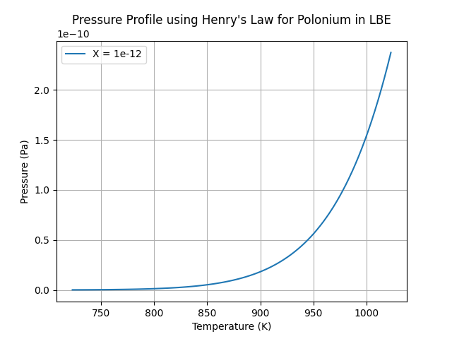

.. _theoretical:

++++++++++++++++++++++++++++++++++
Theoretical notions and approaches
++++++++++++++++++++++++++++++++++

.. _oxygen-control:

Oxygen Control
==============

In lead and lbe systems, oxygen is the most important chemical element, which results
from start-up operations, maintenance services and, possibly, incidental contaminations (:cite:`Agency2015`).
To operate a nuclear reactor cooled by a lead alloy, it is thus important to
determine the upper and the lower oxygen concentration limits.

.. _ Oxygen concentration upper limit:

Oxygen Concentration Upper Limit
--------------------------------

The upper limit corresponds to the oxygen concentration value above which contamination by coolant oxides occurs.
It is represented by the *oxygen solubility* in lead and lbe alloys. *lbh15* provides
these properties in the ``lead_thermochemical_properties.solubility_in_lead``
and ``lbe_thermochemical_properties.solubility_in_lbe`` modules.
The implemented data are extracted from :cite:`Agency2015`, table 3.5.2,
"*Oxygen solubility in liquid Pb, Bi and LBE*", page 157: they were obtained by linear regression of
several correlations specified therein.

.. _ Oxygen concentration lower limit:

Oxygen Concentration Lower Limit
--------------------------------

The lower limit corresponds to the minimum value of the oxygen concentration enabling the formation of a protective oxide layer on the structural material.
The oxide layer formation is possible only when the oxygen potential in the liquid metal is above the
potential leading to the protective film formation. The correlations implemented in the
``lead_thermochemical_properties.lead_oxygen_limits`` and ``lbe_thermochemical_properties.lbe_oxygen_limits``
modules for computing the lower limits of oxygen concentration are obtained by applying the methodology
described in :cite:`Agency2015`, chapter 4, part 4.2.2, pages 187-192. A brief summary is provided in the following.

First of all, the reference reaction equation and the associated Gibbs free energy are determined. Then, the oxygen
concentration is expressed as a function of temperature. Eventually, two kinds of correlations, based on two different
assumptions, are derived.

..

  1. The equation :eq:`oxide_react_eq` of the oxidation reaction is set by considering that it occurs
     between the metal and the oxygen, with the oxygen supposed in solution as dissolved :math:`\ce{PbO}` below its saturation limit.
     The formation equation :eq:`metal_oxide_eq` of the metal oxide (equation 4.5, page 188 of :cite:`Agency2015`) is combined with the formation
     equation :eq:`pbo_eq` of :math:`\ce{PbO}`, (table 4.2.2, page 189 of :cite:`Agency2015`):

     .. math:: \ce{\frac{2X}{Y}Me_{\left(dissolved\right)} + O_{2\left(dissolved\right)} -> \frac{2}{Y}Me_XO_Y}
      :label: metal_oxide_eq

     .. math:: \ce{2Pb + O_2 -> 2PbO}
      :label: pbo_eq

     thus resulting in the following oxidation reaction equation for a mole of :math:`\ce{PbO}`:

     .. math:: \ce{\frac{X}{Y}Me_{\left( dissolved \right)} + O_{\left(dissolved\right)} + PbO -> \frac{1}{Y}Me_XO_Y + Pb + O}
      :label: oxide_react_eq

     where:

     - :math:`\ce{Me}` represents the metal of the structural material involved in the oxidation reaction,
     - :math:`\ce{X}` and :math:`\ce{Y}` are coefficients specific to the reaction.

..

  2. The Gibbs free energy associated to equation :eq:`oxide_react_eq` is:

     .. math::
      \Delta G^0_{\left(3\right)} & = \frac{\Delta G^0_{\left(1\right)}-\Delta G^0_{\left(2\right)}}{2}

      & = \frac{\left(\Delta H^0_{\left(1\right)}-T\cdot\Delta S^0_{\left(1\right)}\right)-\left(\Delta H^0_{\left(2\right)}-T\cdot\Delta S^0_{\left(2\right)}\right)}{2}

      & = \frac{\Delta H^0_{\left(3\right)}-T\cdot\Delta S^0_{\left(3\right)}}{2},
     
     where:

     - :math:`\Delta G^0_{\left(i\right)}` is the Gibbs free energy of formation related to the (:math:`i`)-th reaction equation;
     - :math:`\Delta H^0_{\left(3\right)} = \Delta H^0_{\left(1\right)}-\Delta H^0_{\left(2\right)}` is the formation enthalpy related to equation :eq:`oxide_react_eq`;
     - :math:`\Delta S^0_{\left(3\right)} =\Delta S^0_{\left(1\right)}-\Delta S^0_{\left(2\right)}` is the formation entropy related to equation :eq:`oxide_react_eq`;
     - :math:`\Delta H^0` and :math:`\Delta S^0` values for each reaction are taken from the table 4.2.2 of :cite:`Agency2015`.

..

  3. In general, the Gibbs free energy of a reaction can also be expressed in the following way:

     .. math:: \Delta_rG^0 \left(T\right) = -R \cdot T \cdot \ln{\left(K \left(T\right)\right)},
      
     where:

     - :math:`T` is the temperature in :math:`\left[K\right]`;

     - :math:`R` is the molar gas constant in :math:`\left[J\cdot K^{-1} \cdot mol^{-1}\right]`;

     - :math:`\Delta_rG^0 \left(T\right)` is the standard free enthalpy of reaction at constant pressure
       and temperature in :math:`\left[J\cdot mol^{-1}\right]`;

     - :math:`K \left(T\right) = \prod\limits_{i=1}^{N} \alpha_i^{\nu_i}` is the equilibrium constant,
       being :math:`\alpha_i` the chemical activity of the :math:`i`-th species at the equilibrium,
       :math:`\nu_i` the stoichiometric coefficient of the :math:`i`-th species in the related reaction
       (positive for the reaction products and negative for the reactants), and :math:`N` the number of
       components appearing in the related reaction.

     In detail, the chemical activity :math:`\alpha` is a dimensionless quantity used to express the deviation
     of a mixture of chemical substances from a standard behavior. It is defined by the following relations:

     - :math:`\alpha_i = \gamma_i\cdot\chi_i` , being :math:`\gamma` the dimensionless activity coefficient
       of the :math:`i`-th species and :math:`\chi_i` the molar fraction of the same species;

     - :math:`\alpha_i = \gamma_i\cdot\frac{C_i}{C_{iref}}`, being :math:`C_i` the concentration of the
       :math:`i`-th species in the mixture and :math:`C_{iref}` the reference concentration for the same species.

     In :cite:`Agency2015`, the concentration at saturation is adopted as reference concentration. In addition,
     by definition, the activity coefficient is assumed equal to one in two cases: when the related species is a pure chemical
     element, and when it is very diluted. The activity of a pure element can then be defined as:
     
     .. math:: \alpha_i=C_i / C_i^{sat}.

     About the chemical activity of lead in lbe, *lbh15* implements the correlation proposed by Gossé (2014)
     and written in chapter 3.3, part 3.3 of :cite:`Agency2015`.

..

  4. The aim is now to develop, for each possible dissolved metal, a correlation for the lower limit of the
     oxygen concentration that has the same structure as the equation 4.12, part 4.2.2 of :cite:`Agency2015`. Starting from the
     oxidation reaction equation :eq:`oxide_react_eq`, the following substitution is applied:

     .. math:: \Delta_rG^0 \left( T \right) = -RT\ln{ \left( \frac{\alpha_{\ce{Pb}} \cdot \alpha_{\ce{Me_XO_Y}}^{\frac{1}{Y}}}{\alpha_{\ce{PbO}}\cdot\alpha_{\ce{Me_{\left( dissolved \right)}}}^{\frac{X}{Y}}} \right)},

     where the term :math:`\alpha_{\ce{Me_XO_Y}}` can be considered equal to one: the lower limit is to be found of the oxygen
     concentration, thus the metal oxide is considered very diluted.

     By considering the oxygen dissolved in the solution in the form of :math:`\ce{PbO}` below its saturation limit, as stated in :cite:`Agency2015`,
     thus taking the chemical activity of the dissolved oxygen equal to the chemical activity of the dissolved :math:`\ce{PbO}`, and by
     applying some transformations, one can obtain:

     .. math:: \ln{\left( C_{\ce{O}} \right)} = \frac{X}{Y} \cdot \ln{\left(\frac{C_{\ce{Me}}^{sat}}{C_{\ce{Me}}}\right)} + \frac{\Delta H^0_{\left(3\right)}}{2RT} - \frac{\Delta S^0_{\left(3\right)}}{2R} + \ln{\left(\alpha_{\ce{Pb}} \cdot C_{\ce{O}}^{sat}\right)}.
      :label: ox_conc_eq

     In the above equation, the unknows are two, that is, the oxygen concentration :math:`C_{\ce{O}}` and the concentration
     :math:`C_{\ce{Me}}` of the dissolved metal, thus preventing the direct computation of the solution. For achieving
     a useful correlation, the user can choose between two strategies that are proposed and adopted in *lbh15*. They differ
     on how they treat the chemical activity of the dissolved metal. The actual activities at the interface are
     influenced by how diffusion, convection and mass transfer phenomena interact in the liquid metal boundary layer.
     In spite of the ongoing research, the exact values for the chemical activities of the dissolved
     metal and of the oxygen are not known.

     a. The first approach is to consider the chemical activity of the dissolved metal equal to one.
        In this way, the first and the second terms of the right hand side of equation :eq:`ox_conc_eq` become zero, enabling to
        compute the lower limit of the oxygen concentration directly through the following relation:

        .. math:: C_{\ce{O}} = \alpha_{\ce{Pb}} \cdot C_{\ce{O}}^{sat} \cdot \exp{\left(\frac{\Delta H^0_{\left(3\right)}}{2RT} - \frac{\Delta S^0_{\left(3\right)}}{2R} \right)},

        where:
  
        - :math:`\Delta H^0_{\left(3\right)}` and :math:`\Delta S^0_{\left(3\right)}` are extracted from table 4.2.2 of :cite:`Agency2015`;

        - :math:`C_{\ce{O}}^{sat}` is computed by adopting the recommended coefficients from table 3.5.2 of :cite:`Agency2015`;

        - :math:`\alpha_{\ce{Pb}}` is taken equal to one in pure Lead, while in lbe it is computed by adopting the
          correlation proposed by Gossé as indicated at page 146 of :cite:`Agency2015`.

     b. The second approach does not exploit any assumption. In order to make equation :eq:`ox_conc_eq` solvable, the two unknowns
        :math:`C_{\ce{O}}^{sat}` and :math:`C_{\ce{Me}}` are collected into one single unknown, thus expressing equation :eq:`ox_conc_eq` in terms
        of :math:`C_{\ce{O}} \cdot C_{\ce{Me}}^{\frac{X}{Y}}`, as indicated in the following:

        .. math:: C_{\ce{O}} \cdot C_{\ce{Me}}^{\frac{X}{Y}} = \alpha_{\ce{Pb}} \cdot C_{\ce{O}}^{sat} \cdot \left(C_{\ce{Me}}^{sat}\right)^{X/Y} \cdot \exp{\left(\frac{\Delta H^0_{\left(3\right)}}{2RT} - \frac{\Delta S^0_{\left(3\right)}}{2R}\right)},

        where:

        - :math:`C_{\ce{Me}}^{sat}` values are computed by using the data from table 3.5.1 of :cite:`Agency2015`;

        - :math:`\Delta H^0_{\left(3\right)}`, :math:`\Delta S^0_{\left(3\right)}`, :math:`C_{\ce{O}}^{sat}` and :math:`\alpha_{\ce{Pb}}` are computed as already
          indicated for the approach described above.

.. _ Ranges of validity:

Ranges of Validity
------------------

As stated in the previous section, multiple correlations are involved in the computation of the lower limits of
oxygen concentration, each being valid over a specific temperature range. The validity range of a specific lower limit
is then defined as the intersection of the validity ranges of the correlations on which the lower limit itself depends.
More details as follows:

  - For the lower limit correlations based on the saturation assumption (approach *a*), the lower temperature
    value is taken equal to the lower limit of the validity range of the oxygen solubility correlation,
    while the upper temperature value is taken equal to the upper limit of the validity range of the main
    oxides free enthalpy coefficients. The result is the [673;1000] *[K]* range.
  
  ..

  - For the lower limit of the oxygen concentration times the metal concentration raised to a certain exponent (approach *b*),
    the validity range is taken equal to that in the approach *a*, that is, [673;1000] *[K]*, but for the following correlations:

    - Concerning the chromium solubility in lbe given by Courouau in 2004, the upper limit of the validity range
      is taken equal to the upper limit of the validity range of the corresponding chromium solubility correlation, resulting in the [673;813] *[K]* range;

    ..

    - Concerning the chromium solubility in lbe given by Martynov in 1998, the upper limit of the validity range
      is taken equal to the upper limit of the validity range of the corresponding chromium solubility correlation, resulting in the [673;773] *[K]* range;

    ..

    - Concerning the nickel solubility in lead given by Gossé in 2014, the upper limit of the validity range
      is taken equal to the upper limit of the validity range of the corresponding nickel solubility correlation, resulting in the [673;917] *[K]* range;

    ..
    
    - Concerning the chromium solubility in lead given by Venkatraman in 1998 and by Alden in 1958, and the silicon solubility
      in lead, there is no overlapping of the temperature validity ranges. It has then been decided
      to adopt the [673;1000] *[K]* range in analogy with the most of the other correlations. This is why the related
      correlations need to be used carefully.

.. _ Correlations adopted by default:

Correlations Adopted by Default
-------------------------------

For most of the properties, correlations from different authors are available. This section provides a list of the
correlations chosen as the default ones in *lbh15*. For all the non-mentioned properties, only one correlation is
implemented since either it is the only one available or it is specifically recommended in :cite:`Agency2015`:

- *Gossé* correlation of 2014 for the solubility of iron, nickel and chromium in lead, lbe and bismuth;

..

- *Alcock* correlation of 1964 for the oxygen partial pressure divided by the oxygen concentration squared in lead;

..

- *Isecke* correlation of 1979 for the oxygen partial pressure divided by the oxygen concentration squared in bismuth;

..

- *Gromov* correlation of 1996 for the oxygen diffusivity in lead and in lbe;

..

- *Fitzner* correlation of 1964 for the oxygen diffusivity in bismuth.

..

The choice of the above default correlations has been driven by what recommended in :cite:`Agency2015` and by the temperature ranges.
In particular, since most of the liquid lead applications are working at low temperatures, preference is given to those correlations
whose range of validity is based on the lowest available temperature value and is the widest available.

The user is invited to check the ranges of validity of the correlations she/he is using to make sure they match with the specific
application requirements. In case other correlations are needed that are different from the ones already implemented in *lbh15*, please see
:any:`advanced-usage` section.

.. _impurities:

Impurities introduced by nuclear reactions
==========================================

In addition to its primary functions as a target material and heat transfer medium, the liquid metal in a spallation target also acts as a solvent and reaction
medium for nuclear reaction products, including polonium, mercury, and other metallic impurities. The typical quantities and concentrations of impurities that have been detected in different facilities,
and predicted by using nuclear codes, show considerable variability. Such variabilities require detailed investigations and the implementation of appropriate
management strategies.

The volatilisation of radioactive species is the most significant physico-chemical process involving impurities generated by irradiation in a liquid metal target
or reactor pool. This phenomenon is of great importance in assessing the release of radioactivity in both operational and accidental scenarios. Initially, these
products exist in atomically dispersed form. Then, when they reach a sufficient concentration, they react to form compounds or begin to evaporate. The degree of
dilution and the chemical interaction with the solvent (lead, bismuth or LBE) can modify the thermodynamic activity of these products, thereby also influencing
the thermodynamic state of the medium. At the same time, the composition of the cover gas can change, then it is necessary to monitor it to ensure the safe
operation of the system.

In this context, the main aim is to estimate the maximum gas-phase concentrations of radionuclides in the cover gas (of liquid metal targets and reactor systems)
based on equilibrium of vapor pressures.

The following assumptions are made:

- the system being analyzed is closed;

- the solution of impurities in the heavy liquid metals is diluted;

- the pressure is low.

All such assumptions are valid for the LFR.

Correlations for vapour pressure, Henry constant and chemical activity coefficient of the impurities allows the estimation of the vapour pressure of the solution
made of the heavy liquid metal and impurities dissolved therein, thus helping determining the composition of the cover gas and possible related dangers in case the
reactor is opened, due for example to maintenance operations or leakages creation.

The following laws are then used to estimate the composition of the cover gas:

- Raoult's law: 

  .. math:: P_{A} = P_{A}^{\circ} \cdot \gamma_{A} \cdot X_{A}

- Henry's law: 

  .. math:: P_{A} = K_{H,A} \cdot X_{A}

  where:

  .. math::`K_{H,A} = P_{A}^{\circ} \cdot \gamma_{A}` the Henry constant.

.. _exampleofuse:

Example of use
--------------

This example illustrates how the Henry constant correlation of polonium in LBE can be used to estimate 
the partial pressure of such a contaminant at different temperature values.

In this example, we consider a generic volume of LBE subjected to varying temperature conditions and utilise 
the Henry constant correlation to estimate the concentration of polonium in the vapor phase. 

The Henry constant of polonium over lead-bismuth eutectic :math:`K_{H(Po(LBE))}` can be expressed using empirical
correlations, derived from experimental measurements. The correlation is implemented in 
:py:mod:`lbh15.properties.lbe_thermochemical_properties.lbe_contamination.py` in the class 
*LBEPoloniumHenryConstantOhno2006*.

According to the Henry's Law, the partial pressure of polonium in LBE is given by the following expression:

.. math:: P_{Po(LBE)} = K_{H,Po(LBE)} \cdot X_{Po(LBE)}

With :math:`X_{Po(LBE)}` the molar fraction of Polonium in liquid LBE, generally between :math:`10^{-12}` and :math:`10^{-10}`.

On the range [723.0, 1023.0 K] given by the Handbook, with molar fraction of :math:`10^{-12}`, the vapour pressure of Polonium in liquid LBE shows this behaviour 9 (see :numref:`pressPo`):

.. raw:: latex

   \clearpage

.. _pressPo:

    
    Evolution of Polonium vapour pressure in liquid LBE as a function of temperature.

Using the following code:

.. code-block:: python

    import numpy as np
    import matplotlib.pyplot as plt
    from lbh15.properties.lbe_thermochemical_properties.lbe_contamination import LBEPoloniumHenryConstantOhno2006
    from lbh15.lbe import LBE

    # Define initial parameters
    T_start = 398.0
    X = 10**(-12)

    # Create the LBE liquid object
    liq = LBE(T=T_start)

    # Instantiate the object for Polonium Henry constant
    K_Po = LBEPoloniumHenryConstantOhno2006()

    # Generate temperature values within the valid range of the correlation
    T_values = np.linspace(K_Po.range[0], K_Po.range[1], 100)

    # Calculate pressures using Henry's law
    P_values = np.array([K_Po.correlation(T) * X for T in T_values])

    # Plot the results
    plt.plot(T_values, P_values, label=f'X = {X}')
    plt.xlabel('Temperature (K)')
    plt.ylabel('Pressure (Pa)')
    plt.title('Pressure Profile using Henry\'s Law for Polonium in LBE')
    plt.legend()
    plt.grid(True)
    plt.show()

It is now possible to determine the concentration of polonium in the cover gas by applying the ideal gas law:

.. math:: C_{Po(g)} = \frac{P_{Po(LBE)}}{R \cdot T}

The results (:numref:`concPo`) show a significant increase in polonium partial pressure and associated concentration with increasing temperature. 

.. code-block:: python

    import numpy as np
    import matplotlib.pyplot as plt
    from lbh15.properties.lbe_thermochemical_properties.lbe_contamination import LBEPoloniumHenryConstantOhno2006
    from lbh15.lbe import LBE

    # Define initial parameters
    T_start = 398.1
    X = 10**(-12)

    # Create the LBE liquid object
    liq = LBE(T=T_start)

    # Instantiate the object for Polonium Henry constant
    K_Po = LBEPoloniumHenryConstantOhno2006()

    # Generate temperature values within the valid range of the correlation
    T_values = np.linspace(K_Po.range[0], K_Po.range[1], 100)

    # Calculate concentration of Polonium using Ideal Gas' law
    C_values = np.array([(K_Po.correlation(T) * X) / (8.314 * T) for T in T_values])

    # Plot the results
    plt.plot(T_values, C_values, label=f'X = {X}')
    plt.xlabel('Temperature (K)')
    plt.ylabel('Concentration (mol/L)')
    plt.title('Concentration profile using Ideal Gas\' Law of Polonium in the cover gas')
    plt.legend()
    plt.grid(True)
    plt.show()

.. _concPo:

    
    Evolution of Polonium concentration in the cover gas as a function of temperature.

Ranges of temperature
---------------------

The temperature ranges over which the various correlations are valid are not consistently stated in the Handbook :cite:`Agency2015`.
This section provides a justification for the temperature ranges implemented in lbh15, in cases where precise data are not 
suggested by Handbook :cite:`Agency2015`.

*Impurities in Lead:*

- *LeadPoloniumActivityCoefficientLi1998*:

  For the chemical activity coefficient of polonium given by Li in 1998, the same range as that given for the vapour pressure correlation
  by Abakumov in 1994 is used, since Li refers to this correlation in his work.

..

- *LeadPoloniumHenryConstant*:

  For the Henry constant of polonium given by the Handbook, the same range as that given for the vapour pressure correlation by Abakumov in
  1994 and for the activity coefficient correlation by Li 1998, since it is determined from these two correlations using Henry\'s law.

..

- *LeadIodineActivityCoefficient*:

  In the absence of any information, the temperature range of lead is selected for the purposes of coherence.

..

*Impurities in Bismuth:*

-	*BismuthPoloniumActivityCoefficient*:

  For the chemical activity coefficient of polonium determined by the Handbook, the same range as the
  one used in the experiment of Bradley in 1968 is selected, since it is the experiment upon which the
  Handbook calculates the correlation.

..

-	*BismuthIodineVapourPressureCubicciotti1959*:

  For the vapour pressure or Iodine, this range has been chosen since the correlation overestimates the
  real vapor pressure at any T of bismuth.

..

-	*BismuthCaesiumActivityCoefficientGverdtsiteli1984*:

  The Handbook states that the correlation has been verified up to 1 000K.
  Given that the melting temperature of caesium is considerably lower than that of bismuth, this is why
  the melting temperature of bismuth is chosen as lower limit of the validity range.

..

*Impurities in LBE:*

-	*LBEPoloniumActivityCoefficient*:

  The correlation is derived from two other correlations (5.14) and (5.16), which provide two distinct ranges.
  The correlation 5.14 has a range of [641-877K], whereas the 5.16 is valid on the range [913, 1023K].
  Fig. 5.2.4 at page 258 plots and compares the behavior of several correlations for the activity coefficient of
  Po in Pb and Bi alloys over the temperature range [500 K, 1000 K]. Also, the correlation represented by the property
  LBEPoloniumActivityCoefficient is plotted. But the accompanying explanatory text explicitly states that this correlation
  is based on measurements made above 913 K, so its extrapolation to lower temperatures should not be trusted. This is why
  the validity range of (5.16) is applied also to this correlation in lbh15.

..

-	*LBEIodineHenryConstantNeuhausen2005*:

  As stated at pag. 287 of the HANDBOOK, iodine is retained in LBE for temperature values below 700 K.
  This is the reason why 700 K is implemented as the lower limit of the validity range of this property.
  About the higher limit of this range, the same value indicated for LBEIodineHenryConstantKnacke1991 is
  used since the HANDBOOK states that the correlation by Neuhausen shows the same behavior as the one by
  Knacke for temperature values that are higher than 700 K.

..
  
- *Experimental and under review*:

  For the following impurities in LBE, the nominal ranges in Table 5.2.4 om page 301 are stated to be “around”
  certain temperatures. To ensure the greatest consistency, in line with the ranges presented by these correlations,
  it has been decided that the term "around" will be characterised as :math:`± 0.05 * \delta_{T}`, where :math:`\delta_{T} = T_b0 - T_m0`,
  :math:`T_b0` and :math:`T_m0` being the boiling and melting temperatures of LBE, respectively.
  Here the classes concerned by this approximation:

  - *LBEMercuryHenryConstant*: around 603K

  - *LBEMercuryActivityCoefficient*: around 603K

  - *LBECadmiumHenryConstant*: around 773K

  - *LBECadmiumActivityCoefficient*: around 773K

  - *LBEThalliumHenryConstant*: around 773K

  - *LBEThalliumActivityCoefficient*: around 773K

  - *LBERubidiumVapourPressureLandolt1960*: around 873K

  - *LBERubidiumActivityCoefficient*: around 873K

..

.. _tutorials:

+++++++++
Tutorials
+++++++++

.. _ Control of Oxygen Concentration:

Control of Oxygen Concentration
===============================

This section describes a simple, but meaningful example application where the *lbh15* package features are exploited.
This simple model is useful for the setup of chemistry control of lead. The use of standard and uniform data is
essential into this context to ensure comparability of results.

A generic volume of liquid lead is subjected to a constant heat dissipation. At a specified time, instantaneously,
a heat load is applied that remains constant for the rest of the simulation.

The system behavior can be described by the following heat balance equation, where the transient term on the left
hand side is present, together with the above mentioned heat source terms on the right hand side:

.. math:: \frac{d \left( \rho h \right)}{d t} \quad = \quad Q_{in} + Q_{out},

where:

- :math:`\rho = \rho\left(T\right)` is the lead density :math:`\left[kg / m^3\right]`;
- :math:`h = c_p\left(T\right) \cdot T` is the specific enthalpy :math:`\left[J / kg\right]` of lead;
- :math:`Q_{out}` is the dissipated heat in :math:`\left[W / m^3\right]`, that is kept constant throughout the entire simulation;
- :math:`Q_{in}` is the heat load in :math:`\left[W / m^3\right]` that suddenly, during the simulation, undergoes a step variation; like a Heaviside function, the heat load
  initial value is kept to zero till the instantaneous change, after which it reaches a constant positive value, as illustrated in :numref:`timevsqin`.
  
  .. _timevsqin:
  
  .. figure:: figures/time_Qin.png
    :width: 500
    :align: Center
    
    Time history of the heat load applied to the lead volume.

Suppose the lead volume works in an environment where the creation of an iron oxide layer must be guaranteed on the bounding walls. This requires
the oxygen concentration within the lead to be always within the admissible range having the
:class:`lbh15.properties.lead_thermochemical_properties.solubility_in_lead.OxygenSolubility`
value as upper limit and, as lower limit, the
:class:`lbh15.properties.lead_thermochemical_properties.lead_oxygen_limits.LowerLimitIron`
value. The choice of the iron oxide is just for illustrative
purposes, the same goes for any other oxide formation. The oxygen concentration must then be controlled by supposing the application of an ideal device able
to add and subtract oxygen to/from the lead volume.

The system enabling this kind of control is depicted in :numref:`contrschema`.

.. _contrschema:

.. figure:: figures/controlSchema.png
  :width: 500
  :align: Center

  Control schema of the oxygen concentration within the lead volume.

In detail:

- the *Lead Volume* behaves as stated by the above mentioned heat balance equation, thus providing the actual temperature and oxygen concentration values;
- the *PID Controller* estimates the oxygen concentration value to assure within the *Lead Volume*;
- the *setpoint* the controller should follow is computed as the middle value of the admissibile oxygen concentration range, and it is computed by exploiting the
  actual temperature value of the *Lead Volume*;
- the *PID Controller* tries to reach the setpoint value which changes in time according to the evolution of the *Lead Volume*.

This tutorial implements the just described system by extracting the thermo-physical and the thermo-chemical properties of the lead volume by means
of the *lbh15* package. The user can try more configurations than the one already implemented by changing the value of the following variables:

- Lead initial temperature in :math:`\left[K\right]`;
- Maximum value of the heat load applied to the lead volume in :math:`\left[W / m^3\right]`;
- Time instant when the heat load changes instantaneously in :math:`\left[s\right]`;
- Constant dissipated heat power in :math:`\left[W / m^3\right]`;
- Oxygen initial concentration in :math:`\left[wt.\%\right]`;
- PID controller settings, that is, the *proportional*, the *integral* and the *derivative* coefficients;
- Simulation duration;
- Number of integration time steps.

By looking into the code implementation, the following sections are identified:

- Modules importing:

  .. code-block:: python

    import numpy as np
    from lbh15 import Lead # LBH15 package
    from simple_pid import PID # PID controller
    import support # Supporting functions
  
  where:

  - the lead-related module is imported from the ``lbh15`` package;
  - the ``PID`` module is imported from the ``simple_pid`` package, which is available at
    https://pypi.org/project/simple-pid/
    and can be installed by applying the following instruction:

    .. code-block:: console

      python -m pip install simple-pid
    
    ``simple-pid`` :math:`>= 2.0.0` is required;
  - the ``support`` module collects all the functions that are used in the remaining portion of the code; it imports the ``matplotlib``
    package, which is available at https://pypi.org/project/matplotlib/ and can be installed by applying the following instruction:

    .. code-block:: console

      python -m pip install matplotlib

    ``matplotlib`` :math:`>= 3.7.1` is required;
- Constant and initial values setting:

  .. code-block:: python

    ######
    # Data
    # Operating conditions
    T_start = 800 # Initial lead temperature [K]
    Qin_max: float = 2.1e6 # Maximum value of heat load [W/m3]
    t_jump: float = 100 # Time instant when the heat load jump happens [s]
    Qout: float = -1e6 # Value of dissipated heat power [W/m3]
    Ox_start = 7e-4 # Initial oxygen concentration [wt.%]
    # PID controller settings
    P_coeff: float = 0.75 # Proportional coefficient [-]
    I_coeff: float = 0.9 # Integral coefficient [-]
    D_coeff: float = 0.0 # Derivative coefficient [-]
    max_output: float = Ox_start # Maximum value of the output [wt.%]
    # Simulation settings
    start_time: float = 0 # Start time of the simulation [s]
    end_time: float = 200 # End time of the simulation [s]
    time_steps_num: float = 1000 # Number of integration time steps [-]

- Declaration and initialization of support and solution arrays:

  .. code-block:: python

    #####################
    # Arrays of variables
    # Time
    time, delta_t = np.linspace(start_time, end_time, time_steps_num, retstep=True)
    # Heat load time history
    t_jump = t_jump if start_time < t_jump and end_time > t_jump else\
        (end_time-start_time)/2.0
    Qin_signal = Qin_max * np.heaviside(time - t_jump, 0.5)
    Qin = {t:q for t,q in zip(time, Qin_signal)}
    # Lead temperature
    T_sol = np.zeros(len(time))
    # Oxygen concentrations
    Ox_stp = np.zeros(len(time))
    Ox_sol = np.zeros(len(time))

  where:

  - ``time`` contains all the time instants which the solution is computed at;
  - ``delta_t`` is the integration time step;
  - ``Qin`` is a dictionary containing for each time instant (key) the corresponding heat load value; values coincide with the Heaviside function values stored in ``Qin_signal``;
  - ``T_sol`` is the array where the lead temperature time history will be stored;
  - ``Ox_stp`` is the array where the oxygen concentration setpoint values will be stored that will be followed by the PID controller;
  - ``Ox_sol`` is the array where the oxygen concentration values will be stored that will be suggested by the PID controller;

- Solutions initialization and ``lead`` object instantiation:

  .. code-block:: python

    ########################
    # Set the initial values
    T_sol[0] = T_start
    lead = Lead(T=T_start)
    Ox_stp[0] = support.ox_concentration_setpoint(lead)
    Ox_sol[0] = Ox_start
  
  where:

  - ``lead`` object is instantiated at a reference temperature equal to the initial temperature of the lead volume;
  - the initial value of the oxygen concentration setpoint is taken equal to the middle value of the admissibile operative range of the oxygen concentration as function of temperature;

- PID controller setup:

  .. code-block:: python

    ########################
    # Set the PID controller
    pid = PID(P_coeff, I_coeff, D_coeff,
              setpoint=Ox_stp[0], starting_output=Ox_start/2)
    pid.sample_time = None
    pid.time_fn = support.sim_time
    pid.output_limits = (0, max_output)

  where:

  - the time function ``sim_time`` is imposed to the PID controller, that makes it operate in the simulation time framework;

- Controller system evolution in time:

  .. code-block:: python

    # Solve the balance equation in T and control the oxygen concentration
    i = 1
    for t in time[1:]:
        lead.T = T_sol[i-1]
        T_sol[i], Ox_stp[i], Ox_sol[i] = \
            support.integrate_in_time(lead, t, float(delta_t), Qin[t],
                                      Qout, Ox_sol[i-1])
        pid.setpoint = Ox_stp[i]
        Ox_sol[i] = pid(Ox_sol[i])
        i += 1

  where there is a loop over all the required time instants; for each :code:`i`-th instant:

  - an explicit call is made to the time integration function;
  - the oxygen concentration setpoint is updated correspondingly;
  - the PID is asked to provide the new oxygen concentration value to guarantee within the lead volume;

- Results plotting:

  .. code-block:: python

    #######
    # Plots
    # Qin signal
    support.plotTimeHistory(1, time, np.array(list(Qin.values())),
                            "time [$s$]", "Qin [$W/m^3$]",
                            "Heat Load Time History",
                            "time_Qin.png")
    # T_sol
    support.plotTimeHistory(2, time, T_sol,
                            "time [$s$]", "T [$K$]",
                            "Lead Temperature Time History",
                            "time_T.png")
    # Ox_sol overlapped to Ox_stp
    support.plot2TimeHistories(3, time, Ox_sol, "Control",
                              time, Ox_stp, "Set-Point",
                              "time [$s$]", "Oxygen Concentration [$wt.\\%$]",
                              "Oxygen Concentration vs Setpoint Time History",
                              "time_OxVsOxStp.png")
  
  where:

  - the first call to ``plotTimeHistory()`` returns the 2D plot shown in :numref:`timevsqin`, where the heat load time history is depicted;
  - the second call to ``plotTimeHistory()`` returns the 2D plot where the temperature time history is depicted of the lead volume (see :numref:`timet`);
    
    .. _timet:
    
    .. figure:: figures/time_T.png
      :width: 500
      :align: Center
      
      Time evolution of the temperature of the lead volume.
  
  - the call to ``plot2TimeHistories()`` returns the 2D plot where both the oxygen concentrations time histories are reproduced, that is, the one of the setpoint and the one of the actual oxygen concentration (see :numref:`timeox`);
    
    .. _timeox:
    
    .. figure:: figures/time_OxVsOxStp.png
      :width: 500
      :align: Center
      
      Time evolution of the oxygen concentrations within the lead volume: the oxygen concentration setpoint (orange) and the actual controlled oxygen concentration (blue).

    After an initial transient, the blue curve, representing the controlled oxygen concentration within lead, overlaps almost exactly with the setpoint values (orange curve).
    The overlapping of the two oxygen concentration curves can be improved or worsened by varying the PID coefficients.

.. note:: This tutorial works even with the :class:`.Bismuth` and the :class:`.LBE` classes instances.
