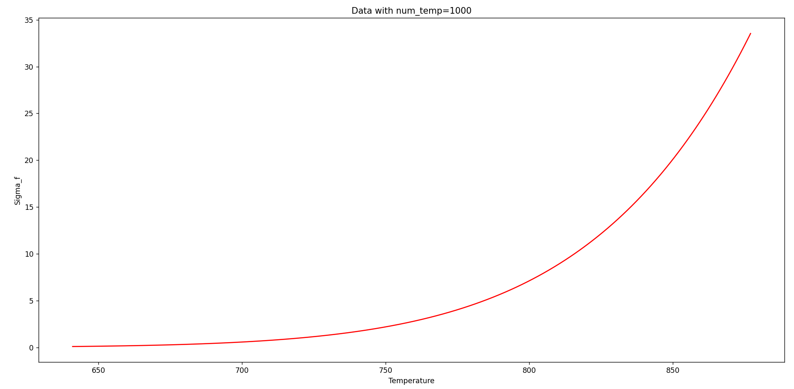
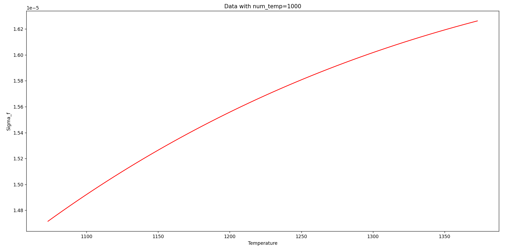
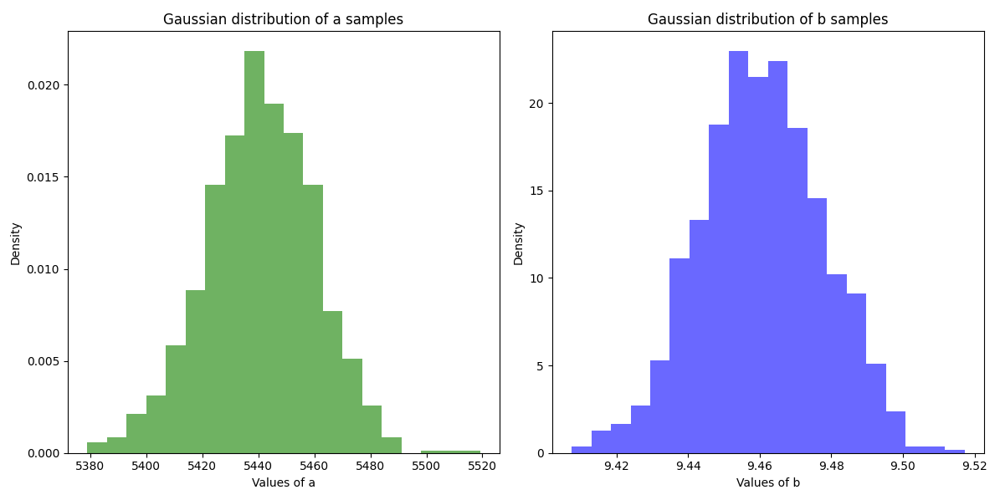
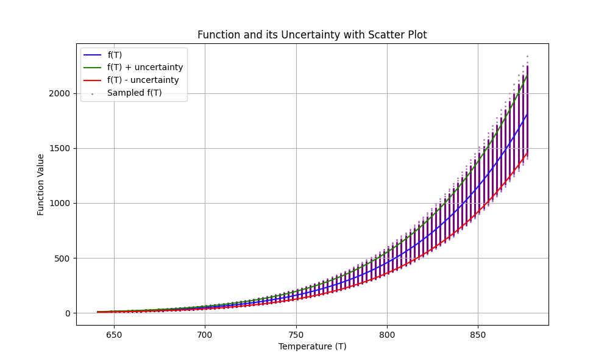

.. raw:: latex

   \setcounter{secnumdepth}{3}

=======
Results
=======

The code is applied to a few correlations. the aim is to visualize and verify that the correlation obtained is the same as the theoretical one.

**Vapour pressure of Metallic Polonium**

The uncertainty correlation is given by :eq:`sigma_p_po`:

The code provides the following uncertainty expression as result:

.. math::
    \sigma_{P_{Po}\degree} = 60\sqrt{6.94..10^{-7}10^{18.92 - \frac{10880}{T}} \log(10)^2 + 10^{18.92 - \frac{10880}{T}} \frac{\log(10)^2}{T^2}}

It is plotted in :ref:`P_Po-figure`.

.. _P_Po-figure:

    Uncertainty of vapour pressure of Polonium as a function of temperature.

.. raw:: latex

   \clearpage

**Oxygen Diffusivity in Lead Homna1971**

The uncertainty correlation is in theory :eq:`sigma_Do`:

.. math::
    \sigma_{D_{o}}^2 = A^{2}\exp({-\frac{2b}{RT}})[ \sigma_{a}^2 + (\frac{\sigma_{b}a}{RT})^2 ]

After running the code, we retrieve the same formula:

.. math::
    \sigma_{D_{o}}^2 = 0.07..*\sqrt{1.01..10^{-8}\exp(-\frac{4831.12..}{T}) + \frac{\exp(-\frac{4831.12..}{T})}{T^2}}

It is plotted in :ref:`Do-figure`.

.. _Do-figure:

    Uncertainty of Oxygen Diffusivity in Lead Homna1971 as a function of temperature.

.. raw:: latex

   \clearpage

============
Verification
============

The aim of this section is to visualize the function :math:`f(T)` and its associated 
uncertainty. Random values of temperature were selected over the range corresponding 
to the selected property. Gaussian samples of *a* and *b* were then scattered
according to their standard deviations (see :cite:`jcgm2008evaluation`):

.. math::
    \text{$\sigma_{a}=\frac{60}{3}$ and $\sigma_{b}=\frac{0.05}{3}$}

  *a* and *b* Gaussian samples of the vapour pressure of Metallic Polonium.

.. .. raw:: latex

..   \clearpage
For each specific temperature value, a scatter of :math:`f(T)` is generated.
The assessment of the uncertainties' estimation is then performed by taking
into account two criterias:

- at least 99% of the values taken by :math:`f(T)`, by varying *a* and *b* values, should be within the uncertainty range;

- the normal distribution fitted over the samples of :math:`f(T)` at a specific temperature
  should return the same mean and standard deviation provided by :eq:`f_p_po` itself and
  by :eq:`sigma_p_po`.

The code plots the function :math:`f(T)`, its associated uncertainty and the
random samples generated at certain T values:
for instance, :numref:`unc_fig` represents the results for the vapour pressure polonium correlation (:eq:`f_p_po`).
In this example, 99.63% of the points fell within the uncertainty range. 
At various temperatures, as shown in the :numref:`tablevalues`, the analytic expressions of
:eq:`f_p_po` and its uncertainty :eq:`sigma_p_po`, and the scattered points yield the same mean and standard deviation.
This confirms that the analytical uncertainty estimates are reliable and
consistent with the expected normal distribution.

.. list-table:: Table of means and standard deviations for different temperatures
   :widths: 25 25 25 25 25
   :name: tablevalues
   :header-rows: 1

   * - Temperature
     - Mean
     - Std
     - Mean Normal
     - Std Normal
   * - 641
     - 9.4346
     - 0.7609
     - 9.4346
     - 0.7609
   * - 700
     - 48.9606
     - 3.6927
     - 48.9606
     - 3.6927
   * - 750
     - 161.3677
     - 11.5714
     - 161.3677
     - 11.5714
   * - 800
     - 458.1915
     - 31.3994
     - 458.1915
     - 31.3994
   * - 877
     - 1811.1592
     - 116.7136
     - 1811.1592
     - 116.7136
   
.. _unc_fig:

    
    Function, uncertainty and scatter of :math:`f(T)`
