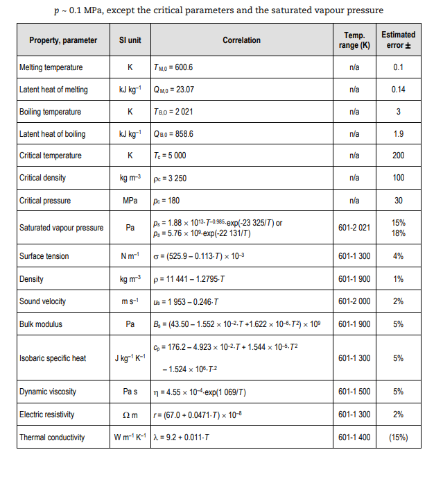
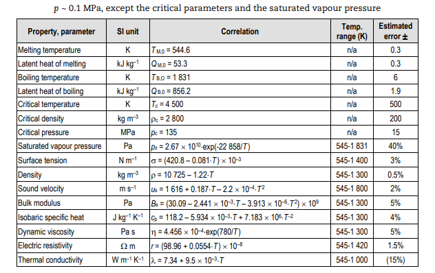
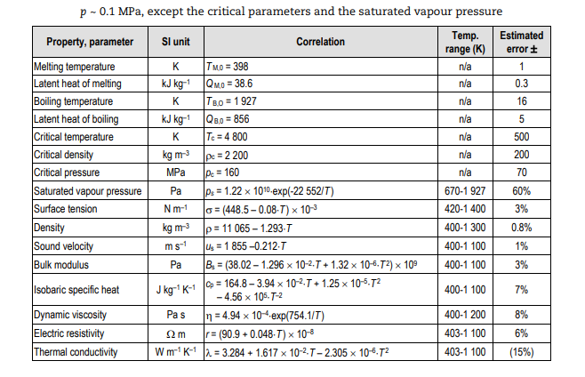

.. raw:: latex

   \setcounter{secnumdepth}{3}

.. |rho| raw:: latex

   \(\rho\)

==================
Data Uncertainties
==================

The Handbook :cite:`Agency2015` gives us uncertainties about data and properties that are summarized in the following tables:

    Summary of the recommended correlations and of the corresponding uncertainties for the thermo-physical properties of liquid lead.

    Summary of the recommended correlations and of the corresponding uncertainties for the thermo-physical properties of molten bismuth.

    Summary of the recommended correlations and of the corresponding uncertainties for the thermo-physical properties of molten LBE.

.. raw:: latex

   \clearpage

========================
Calculated Uncertainties
========================

Based on the correlations demonstrating the dependence between properties and the data detailed in the previous section, it is possible to derive the uncertainty formulas for these properties by applying :eq:`prop_uncer`.

Uncertainty for |rho|:

.. math::
    \sigma_{\rho}^2= \sigma_{\rho_{0}}^2 + \left\{\left(\frac{2\sigma_{u_{s}}}{u_{s}^{3}(T)}\right)^2 + \left(\frac{\alpha(T)T}{c_{p}(T)}\right)^2\left[(2\sigma_{\alpha})^2 + \left(\frac{\alpha(T)}{c_{p}(T)}\sigma_{C_{p}}\right)^2\right]\right\} (p - p_{atm}) 
    :label: sigma_rho

Uncertainty for S:

.. math::
    \sigma_{S}= \frac{MC_{p}(T)\sigma_{C_{p}}}{1000}
    :label: sigma_S

Uncertainty for h:

.. math::
    \sigma_{h}= \sigma_{T_{m_{o}}}\sqrt{ a^2 + (2bT_{m_{o}})^2 + (3cT_{m_{o}}^2)^2 + \left(\frac{d}{T_{m_{o}}^2}\right)^2 }
    :label: sigma_h

Uncertainty for H:

.. math::
    \sigma_{H}= \frac{M\sigma_{h}}{1000}
    :label: sigma_H

Uncertainty for G:

.. math::
    \sigma_{G}^2= \sigma_{H}^2 + T\sigma_{S}^2
    :label: sigma_G

The correlations of Homna, Swzarc and Otsuka on Oxygen Diffusivity in Lead follows :cite:`Agency2015`:

.. math::
    D_{o} = (a\pm\sigma_{a})A\exp\left({-\frac{b\pm\sigma_{b}}{RT}}\right)
    :label: Do

The uncertainty is thus:

.. math::
    \sigma_{D_{o}}^2 = A^2\exp\left(-\frac{2b}{RT}\right)\left[\sigma_{a}^2 + \left(\frac{\sigma_{b}a}{RT}\right)^2\right]
    :label: sigma_Do

